<h2>TensorFlow-FlexUNet-Image-Segmentation-Hokkaido-Iburi-Tobu-Landslide (2025/12/15)</h2>

Toshiyuki Arai 
Software Laboratory antillia.com 
 
This is the first experiment of Image Segmentation for <b>Hokkaido Iburi Tobu Landslide</b> (Singleclass) based on 
our <a href="./src/TensorFlowFlexUNet.py">TensorFlowFlexUNet</a>
 (<b>TensorFlow Flexible UNet Image Segmentation Model for Multiclass</b>)
, and a 512x512 pixels PNG 
<a href="https://drive.google.com/file/d/1Aym54XCS-dlbEtuENcnzc0zxOITxbCX0/view?usp=sharing">
<b>Augmented-Hokkaido-Iburi-Tobu-ImageMask-Dataset.zip </b></a> (3.3GB)
which was derived by us from   
<a href="https://zenodo.org/records/10294997/files/Hokkaido%20Iburi-Tobu.zip?download=1">Hokkaido Iburi-Tobu.zip </a> 
 
<a href="https://zenodo.org/records/10294997">
<b>CAS Landslide Dataset: A Large-Scale and Multisensor 
Dataset for Deep Learning-Based Landslide Detection</b>
</a>
  

<b>Actual Image Segmentation for the Hokkaido-Iburi-Tobu Images of 512x512 pixels</b> 
As shown below, the inferred masks predicted by our segmentation model trained on the 
our augmented dataset appear similar to the ground truth masks. 
<table>
<tr>
<th>Input: image</th>
<th>Mask (ground_truth)</th>
<th>Prediction: inferred_mask</th>
</tr>
<tr>
<td></td>
<td></td>
<td>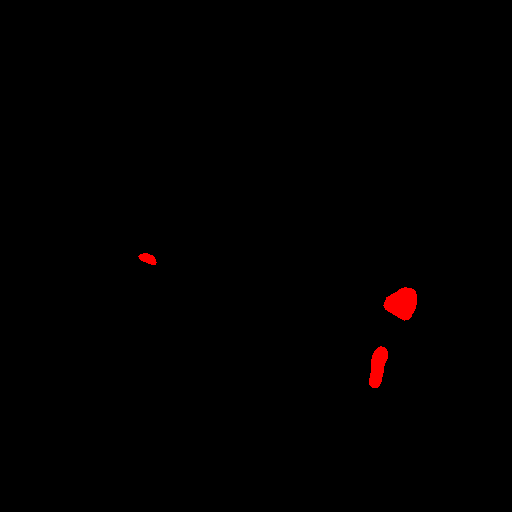</td>
</tr>
</tr>
<td>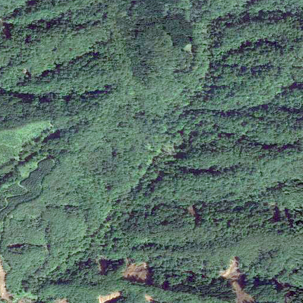</td>
<td>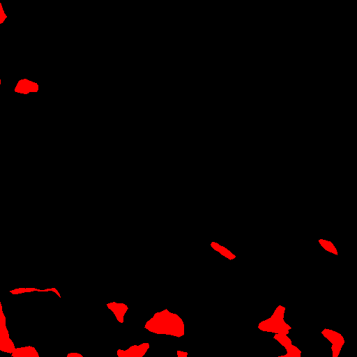</td>
<td>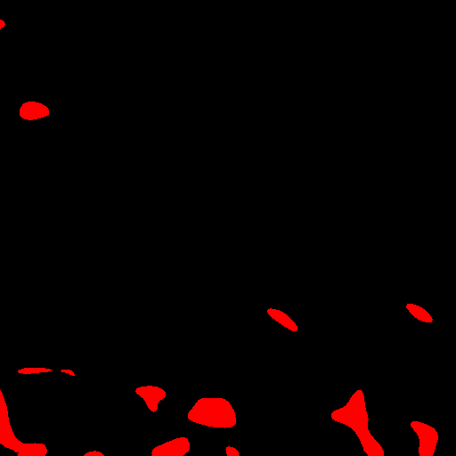</td>
</tr>
<tr>
<td>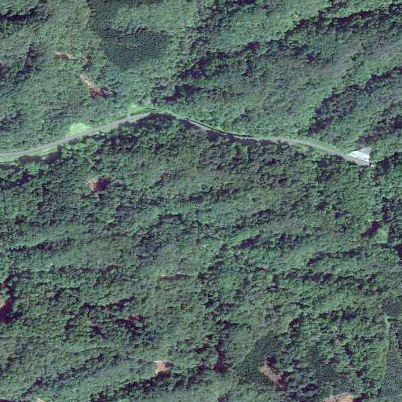</td>
<td>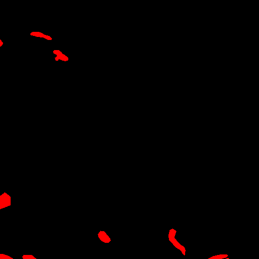</td>
<td>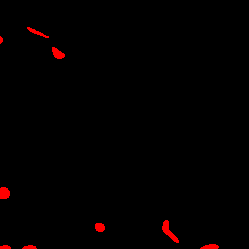</td>
</tr>
</table>

 
<h3>
1 Dataset Citation
</h3>
The dataset used here was derived from   
<a href="https://zenodo.org/records/10294997/files/Hokkaido%20Iburi-Tobu.zip?download=1">Hokkaido Iburi-Tobu.zip </a> 
 
<a href="https://zenodo.org/records/10294997">
<b>CAS Landslide Dataset: A Large-Scale and Multisensor 
Dataset for Deep Learning-Based Landslide Detection</b>
</a>  on the zenodo web site.
  
In this work, we present the CAS Landslide Dataset, a large-scale and multisensor dataset for deep learning-based 
landslide detection, developed by the Artificial Intelligence Group at the Institute of Mountain Hazards 
and Environment, Chinese Academy of Sciences (CAS). The dataset aims to address the challenges encountered in 
landslide recognition.  
With the increase in landslide occurrences due to climate change and earthquakes, 
there is a growing need for a precise and comprehensive dataset to support fast and efficient 
landslide recognition. In contrast to existing datasets with dataset size, coverage, sensor type 
and resolution limitations, the CAS Landslide Dataset comprises 20,865 images, integrating satellite 
and unmanned aerial vehicle data from nine regions.  
 To ensure reliability and applicability, we establish a robust methodology to evaluate the dataset quality.  
 We propose the use of the Landslide Dataset as a benchmark for the construction of landslide identification 
models and to facilitate the development of deep learning techniques.  
Researchers can leverage this dataset to obtain enhanced prediction, monitoring, and analysis capabilities, 
thereby advancing automated landslide detection.
  
<b>Citation</b> 
Xu, Y., Ouyang, C., Xu, Q., Wang, D., Zhao, B., & Luo, Y. (2023). CAS Landslide Dataset: 
 A Large-Scale and Multisensor Dataset for Deep Learning-Based Landslide Detection [Data set]. 
  Zenodo. https://doi.org/10.5281/zenodo.10294997
 
 
<b>License</b> 
<a href="https://creativecommons.org/licenses/by-nc/4.0/legalcode">
Creative Commons Attribution Non Commercial 4.0 International
</a>
 
 
<h3>
2 Hokkaido-Iburi-Tobu ImageMask Dataset
</h3>
<h4>2.1 Download Hokkaido-Iburi-Tobu dataset</h4>
 If you would like to train this Hokkaido-Iburi-Tobu Segmentation model by yourself,
 please download the augmented <a href="https://drive.google.com/file/d/1Aym54XCS-dlbEtuENcnzc0zxOITxbCX0/view?usp=sharing">
 <b>Augmented-Hokkaido-Iburi-Tobu-ImageMask-Dataset.zip</b></a> (3.3GB) 
on the google drive, expand the downloaded, and put it under dataset folder to be:
<pre>
./Hokkaido-Iburi-Tobu
├─test
│  ├─images
│  └─masks
├─train
│  ├─images
│  └─masks
└─valid
    ├─images
    └─masks
</pre>
<b>Hokkaido-Iburi-Tobu Statistics</b> 
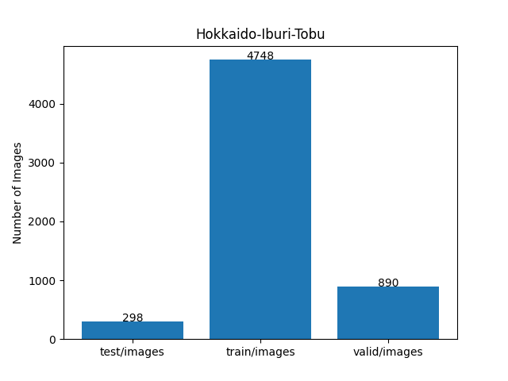 
 
As shown above, the number of images of train and valid datasets is large enough to use for a training set of our segmentation model.
   
<h4>2.2 Hokkaido-Iburi-Tobu Dataset Derivation</h4>
The folder structure of the original 
<a href="https://www.kaggle.com/datasets/niyarrbarman/landslide-divided/data">
<b>Landslide Segmentation</b>
</a>
is the following.
  
<pre>
./Hokkaido Iburi-Tobu
 ├─img
 │  ├─Hokkaido0001.tif
 ...
 │  └─Hokkaido1571.tif
 ├─label
 │  ├─Hokkaido0001.tif
 ...
 │  └─Hokkaido1571.tif
 └─mask
     ├─Hokkaido0001.tif
 ...
     └─Hokkaido1571.tif
</pre>
We used the following 2 Python scripts to derive our 512x512 pixels PNG Augmented-Hokkaido-Iburi-Tobu dataset 
from <b>img</b> and <b>mask</b> folders containing 1,484 TIF files respectively. 
<ul>
<li><a href="./generator/ImageMaskDatasetGenerator.py">ImageMaskDatasetGenerator.py</a></li>
<li><a href="./generator/split_master.py">split_master.py</a></li>
</ul>
 
<h4>2.3 Train Image and Mask samples </h4>
<b>Train_images_sample</b> 
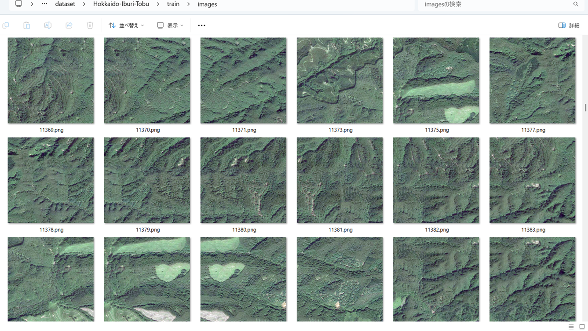
 
<b>Train_masks_sample</b> 
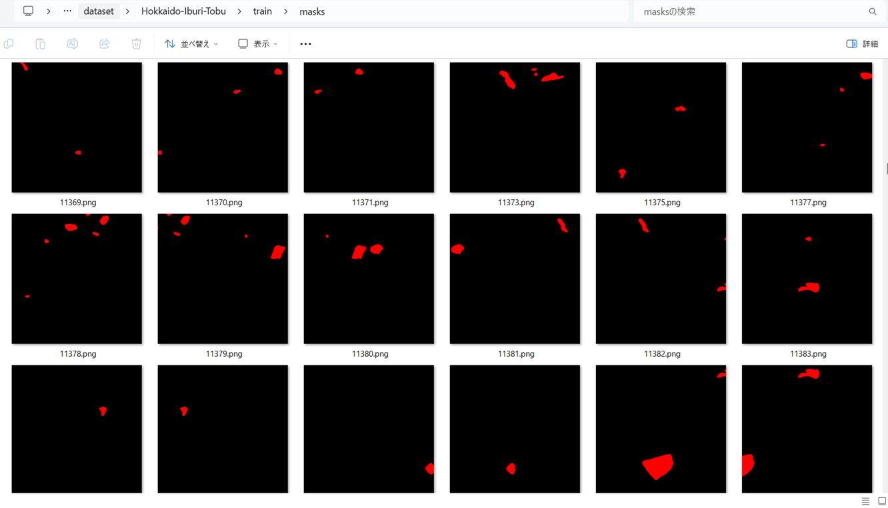
 
 
<h3>
3 Train TensorFlowFlexUNet Model
</h3>
 We trained Hokkaido-Iburi-Tobu TensorFlowFlexUNet Model by using the following
<a href="./projects/TensorFlowFlexUNet/Hokkaido-Iburi-Tobu/train_eval_infer.config"> <b>train_eval_infer.config</b></a> file.  
Please move to ./projects/TensorFlowFlexUNet/Hokkaido-Iburi-Tobu and, and run the following bat file. 
<pre>
>1.train.bat
</pre>
, which simply runs the following command. 
<pre>
>python ../../../src/TensorFlowFlexUNetTrainer.py ./train_eval_infer.config
</pre>

<b>Model parameters</b> 
Defined a small <b>base_filters = 16</b> and a large <b>base_kernels = (11,11)</b> for the first Conv Layer of Encoder Block of 
<a href="./src/TensorFlowFlexUNet.py">TensorFlowFlexUNet.py</a> 
and a large num_layers (including a bridge between Encoder and Decoder Blocks).
<pre>
[model]
image_width    = 512
image_height   = 512
image_channels = 3
input_normalize = True

num_classes    = 2

base_filters   = 16
base_kernels   = (11,11)
num_layers     = 8
dropout_rate   = 0.05
dilation       = (1,1)
</pre>

<b>Learning rate</b> 
Defined a very small learning rate.  
<pre>
[model]
learning_rate  = 0.00007
</pre>

<b>Online augmentation</b> 
Disabled our online augmentation.  
<pre>
[model]
model         = "TensorFlowFlexUNet"
generator     = False
</pre>

<b>Loss and metrics functions</b> 
Specified "categorical_crossentropy" and <a href="./src/dice_coef_multiclass.py">"dice_coef_multiclass"</a>. 
You may specify other loss and metrics function names. 
<pre>
[model]
loss           = "categorical_crossentropy"
metrics        = ["dice_coef_multiclass"]
</pre>
<b>Learning rate reducer callback</b> 
Enabled learing_rate_reducer callback, and a small reducer_patience.
<pre> 
[train]
learning_rate_reducer = True
reducer_factor     = 0.5
reducer_patience   = 4
</pre>

<b>Early stopping callback</b> 
Enabled early stopping callback with patience parameter.
<pre>
[train]
patience      = 10
</pre>

<b>RGB Color map</b> 
<pre>
[mask]
mask_datatype    = "categorized"
mask_file_format = ".png"
;                    landslide: red
rgb_map = {(0,0,0):0, (255,0,0):1,}
</pre>

<b>Epoch change inference callback</b> 
Enabled <a href="./src/EpochChangeInferencer.py">epoch_change_infer callback (EpochChangeInferencer.py)</a></b>. 
<pre>
[train]
poch_change_infer     = True
epoch_change_infer_dir =  "./epoch_change_infer"
epoch_change_tiled_infer     = False
epoch_change_tiled_infer_dir =  "./epoch_change_tiled_infer"
</pre>

By using this callback, on every epoch_change, the inference procedure can be called
 for 6 images in <b>mini_test</b> folder. This will help you confirm how the predicted mask changes 
 at each epoch during your training process.    

<b>Epoch_change_inference output at starting (epoch 1,2,3)</b> 
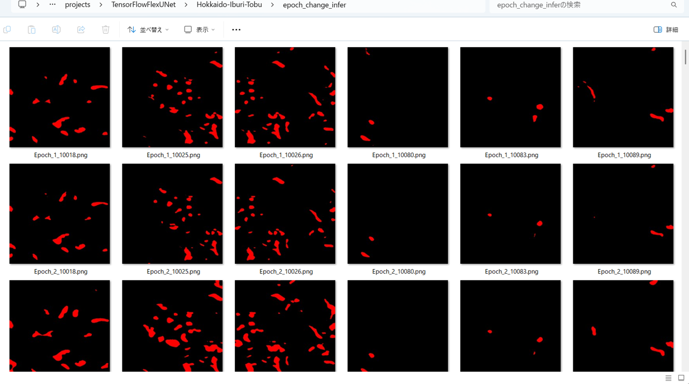 
 
<b>Epoch_change_inference output at middlepoint (epoch 28,29,30)</b> 
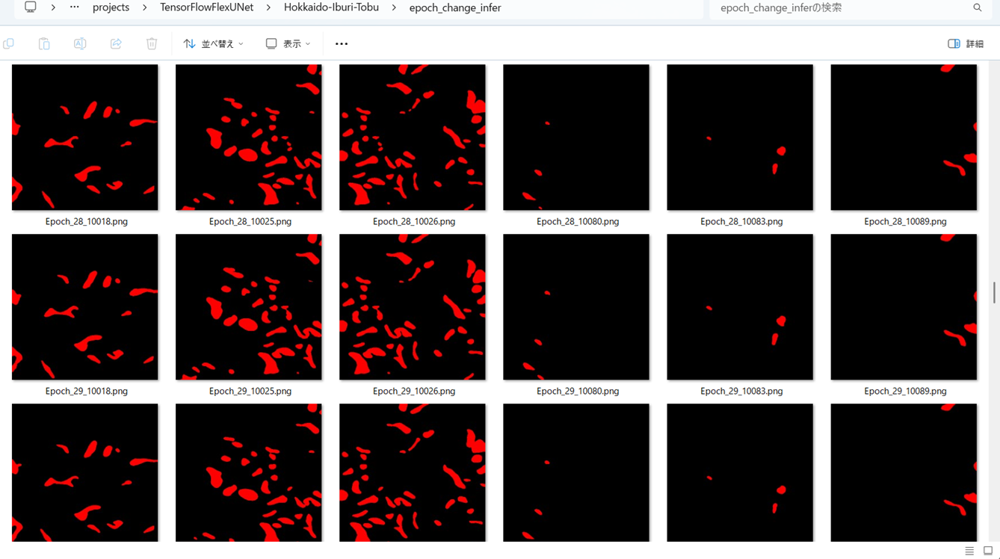 
 

<b>Epoch_change_inference output at ending (epoch 58,59,60)</b> 
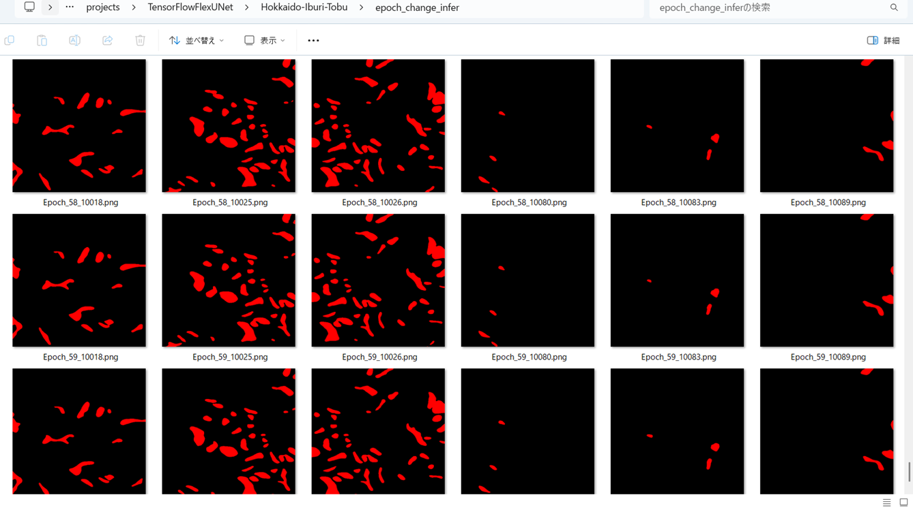 
 

In this experiment, the training process was terminated at epoch 60.  
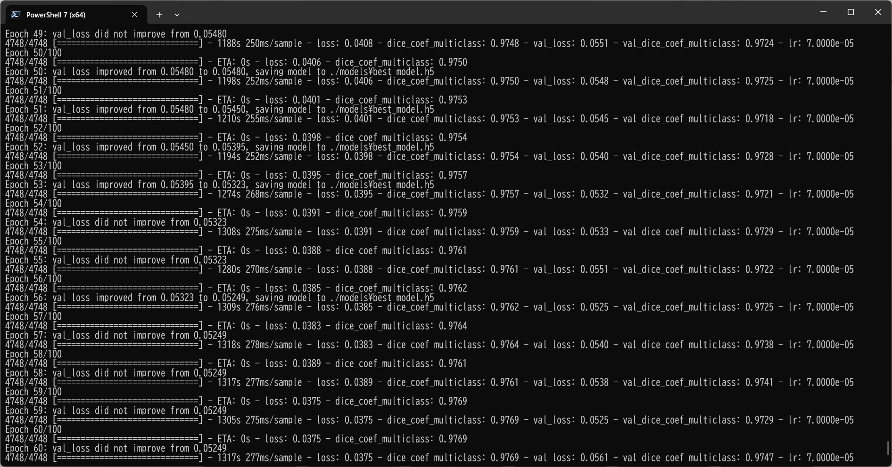 
 
<a href="./projects/TensorFlowFlexUNet/Hokkaido-Iburi-Tobu/eval/train_metrics.csv">train_metrics.csv</a> 
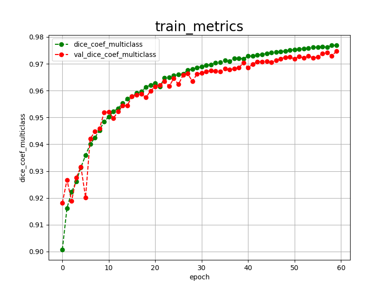 
 
<a href="./projects/TensorFlowFlexUNet/Hokkaido-Iburi-Tobu/eval/train_losses.csv">train_losses.csv</a> 
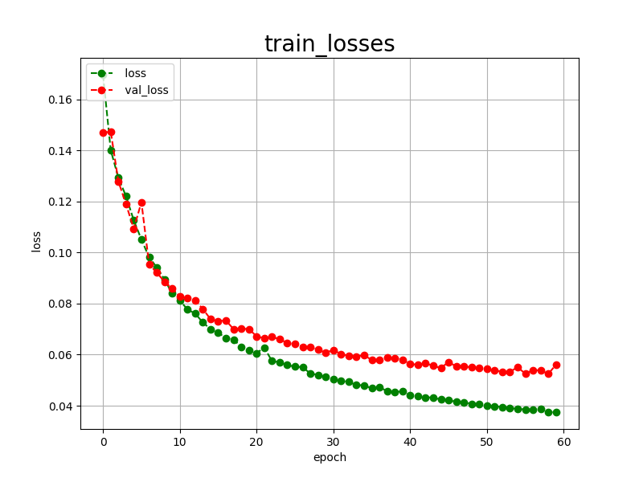 
 
<h3>
4 Evaluation
</h3>
Please move to <b>./projects/TensorFlowFlexUNet/Hokkaido-Iburi-Tobu</b> folder, 
and run the following bat file to evaluate TensorFlowUNet model for Hokkaido-Iburi-Tobu. 
<pre>
./2.evaluate.bat
</pre>
This bat file simply runs the following command.
<pre>
python ../../../src/TensorFlowFlexUNetEvaluator.py ./train_eval_infer.config
</pre>

Evaluation console output: 

  Hokkaido-Iburi-Tobu
<a href="./projects/TensorFlowFlexUNet/Hokkaido-Iburi-Tobu/evaluation.csv">evaluation.csv</a> 
The loss (categorical_crossentropy) to this Hokkaido-Iburi-Tobu/test was not low, and dice_coef_multiclass not high as shown below.
 
<pre>
categorical_crossentropy,0.0476
dice_coef_multiclass,0.9743
</pre>
 
<h3>
5 Inference
</h3>
Please move to <b>./projects/TensorFlowFlexUNet/Hokkaido-Iburi-Tobu</b> folder 
,and run the following bat file to infer segmentation regions for images by the Trained-TensorFlowFlexUNet model for Hokkaido-Iburi-Tobu. 
<pre>
./3.infer.bat
</pre>
This simply runs the following command.
<pre>
python ../../../src/TensorFlowFlexUNetInferencer.py ./train_eval_infer.config
</pre>

<b>mini_test_images</b> 
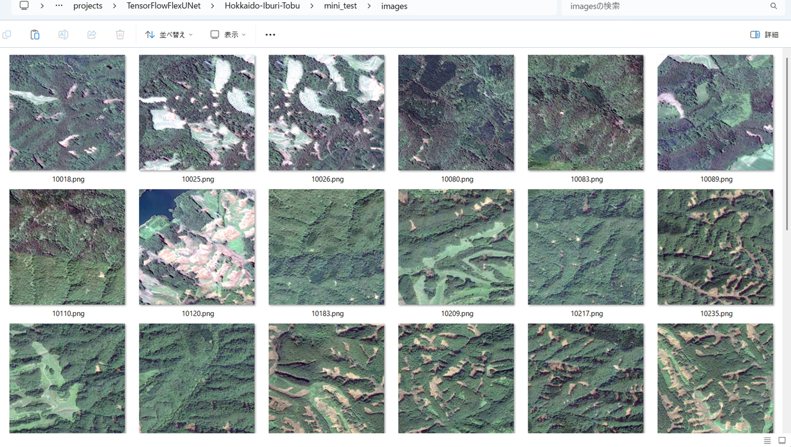 
<b>mini_test_mask(ground_truth)</b> 
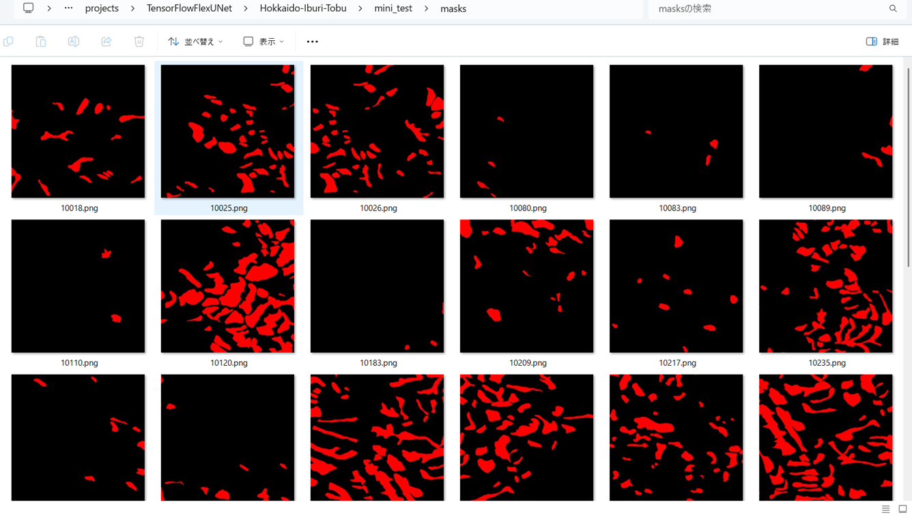 

<b>Inferred test masks</b> 
 
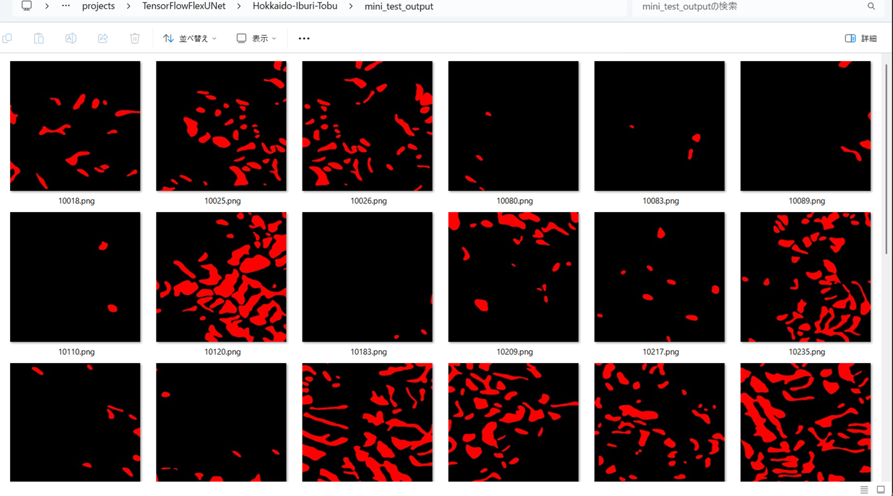 
 

<b>Enlarged images and masks for the Hokkaido-Iburi-Tobu Images of 512x512 pixels </b> 
As shown below, the inferred masks predicted by our segmentation model trained on the 
augmented dataset appear similar to the ground truth masks. 
<table>
<tr>
<th>Image</th>
<th>Mask (ground_truth)</th>
<th>Inferred-mask</th>
</tr>

<td>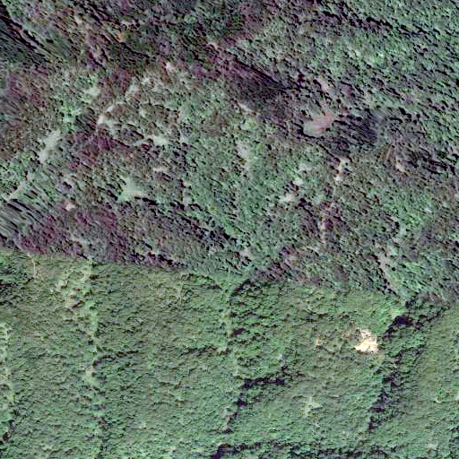</td>
<td>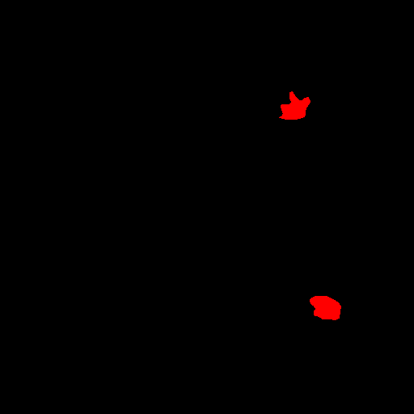</td>
<td>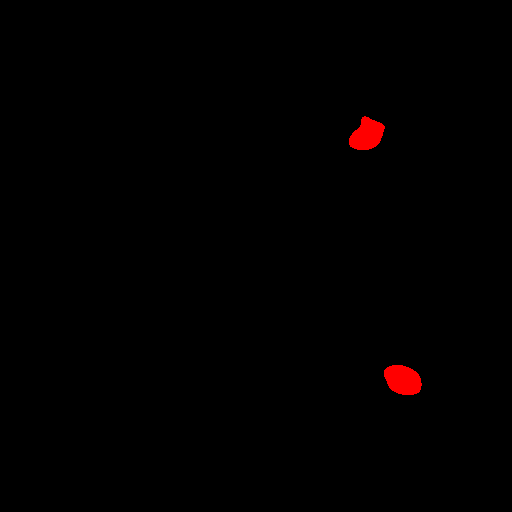</td>
</tr>
<tr>
<td></td>
<td></td>
<td></td>
</tr>
<tr>
<td>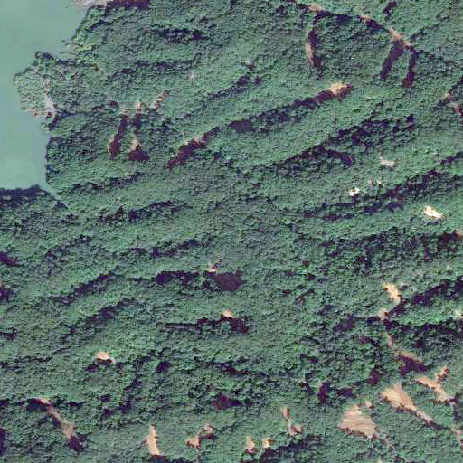</td>
<td>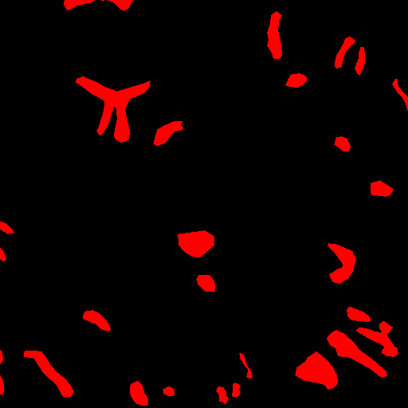</td>
<td>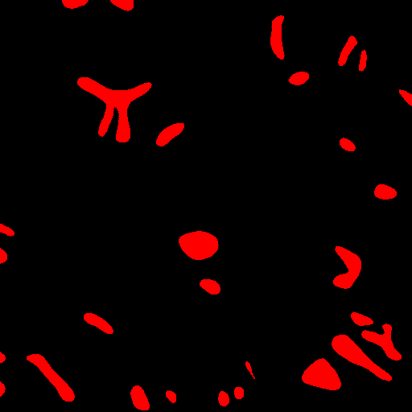</td>
</tr>

<tr>
<td></td>
<td></td>
<td></td>
</tr>
<tr>
<td>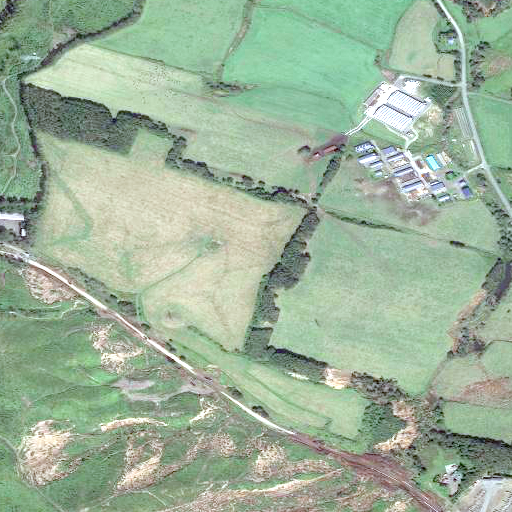</td>
<td>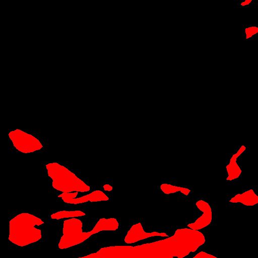</td>
<td></td>
</tr>
<tr>
<td>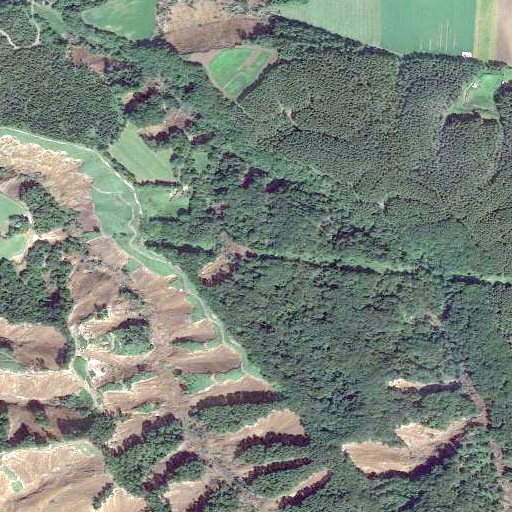</td>
<td>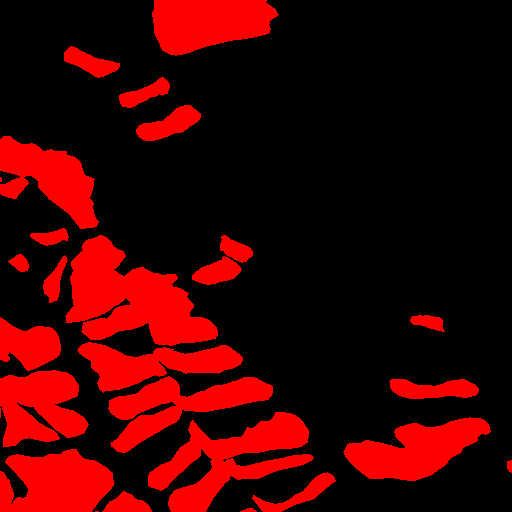</td>
<td>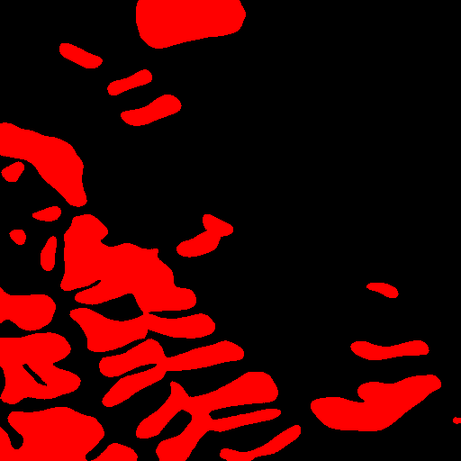</td>
</tr>
</table>

 
<h3>
References
</h3>
<b>1. Landslide4Sense: Multi-sensor landslide detection competition & benchmark dataset</b> 
Institute of Advanced Research in Artificial Intelligence 
<a href="https://github.com/iarai/Landslide4Sense-2022">
https://github.com/iarai/Landslide4Sense-2022</a>
 
 
<b>2. The Outcome of the 2022 Landslide4Sense Competition:  Advanced Landslide Detection From Multisource Satellite Imagery
</b> 
Omid Ghorbanzadeh; Yonghao Xu; Hengwei Zhao; Junjue Wang; Yanfei Zhong; Dong Zhao 
<a href="https://ieeexplore.ieee.org/document/9944085">
https://ieeexplore.ieee.org/document/9944085
</a>
 
 
<b>3. TensorFlow-FlexUNet-Image-Segmentation-Model</b> 
Toshiyuki Arai antillia.com  
<a href="https://github.com/sarah-antillia/TensorFlow-FlexUNet-Image-Segmentation-Model">
https://github.com/sarah-antillia/TensorFlow-FlexUNet-Image-Segmentation-Model
</a>
 
 
<b>4. TensorFlow-FlexUNet-Image-Segmentation-Landslide4Sense</b> 
Toshiyuki Arai antillia.com  
<a href="https://github.com/atlan-antillia/TensorFlow-FlexUNet-Image-Segmentation-Landslide4Sense">
https://github.com/atlan-antillia/TensorFlow-FlexUNet-Image-Segmentation-Landslide4Sense
</a>
 
 
<b>5. TensorFlow-FlexUNet-Image-Segmentation-Japan-Landslide</b> 
Toshiyuki Arai antillia.com  
<a href="https://github.com/atlan-antillia/TensorFlow-FlexUNet-Image-Segmentation-Japan-Landslide">
https://github.com/atlan-antillia/TensorFlow-FlexUNet-Image-Segmentation-Japan-Landslide
</a>

